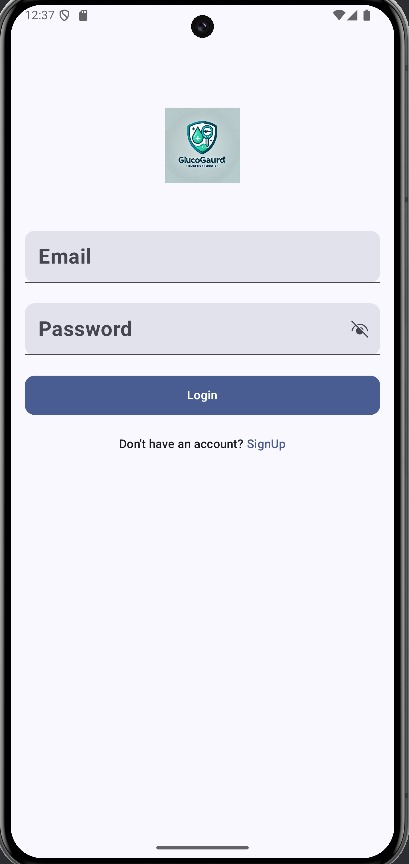
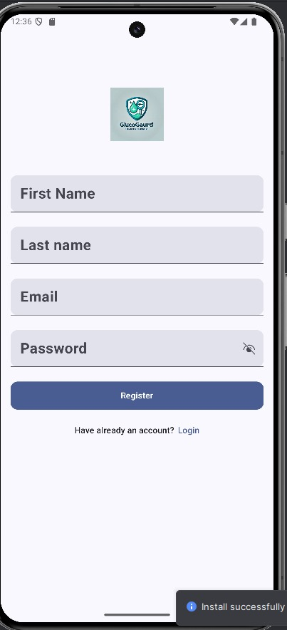
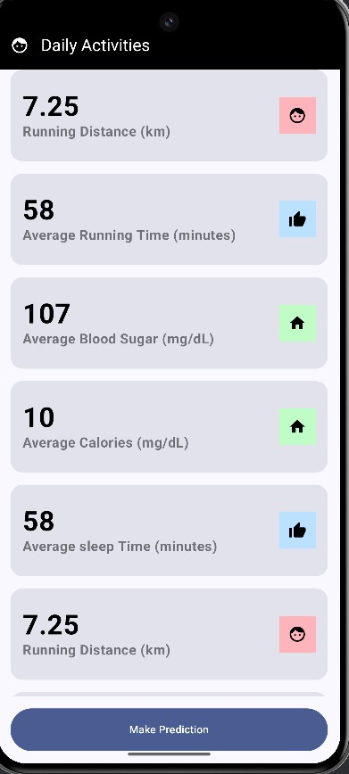
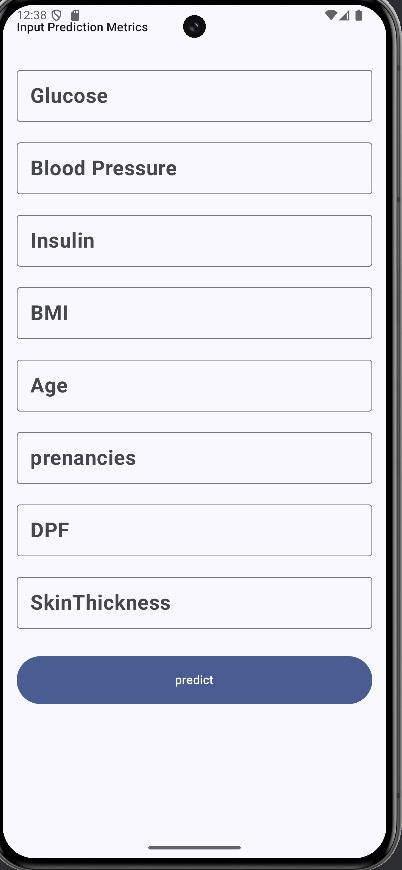
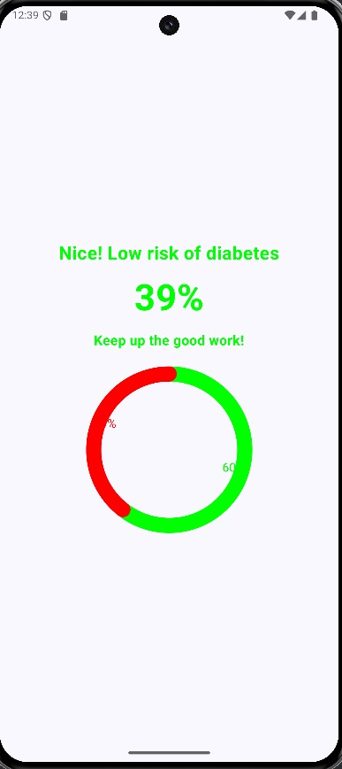

<h1 align="center">GlucoGuad</h1>

GlucoGaud is an app built in Kotlin for the frontend and python(django, django rest framework) for the backend that uses Machine Learning to predict the 
likelihood of diabetes based on user-provided metrics.
metrics like 
- #### blood Glucose level
- #### Blood Insulin level
- #### Age
- #### Number of pregnancies
- #### Diabetic Pedigree Function Value
- #### Skin Thickness
- #### Blood Pressure
- #### BMI

## Overview

GlucoGuad empowers users to assess their risk of 
diabetes through a simple, user-friendly interface. By inputting specific health metrics, users receive a prediction about their likelihood of having or developing diabetes.

## Features

- **ML-Powered Predictions**: Utilizes advanced machine learning algorithms to analyze user data and provide accurate (89%) diabetes risk assessments.
- **Simple Interface**: Easy-to-use input system for entering health metrics.
- **Instant Results**: Get your diabetes risk prediction immediately after entering your data.
- **For Everyone**: Designed to be accessible and useful for all individuals, regardless of their medical background.

## How It Works
0.  ## Login or register

    
    

1. ## Enter your health metrics

    

2. Our ML model processes your data
3. Receive an instant prediction of your diabetes risk

    

## Technology

GlucoGuad is built using 
- ##### Kotlin (Jetpack Compose) for the front end
- ##### Python (django, django rest framework) for back end ana api
- ##### postgres for the Database

## Installation

You can download the apk file [here](https://drive.google.com/file/d/1_FSIx7hnUl89POV6rj-cjkDVjfbUnOQf/view?usp=sharing) and install it 
directly on your android mobile

## Disclaimer

GlucoGaud is designed for informational purposes only and should not be considered a substitute for professional medical advice, diagnosis, or treatment. Always consult with a qualified healthcare provider for medical concerns.

## Feedback and Support

We welcome your feedback and questions!

